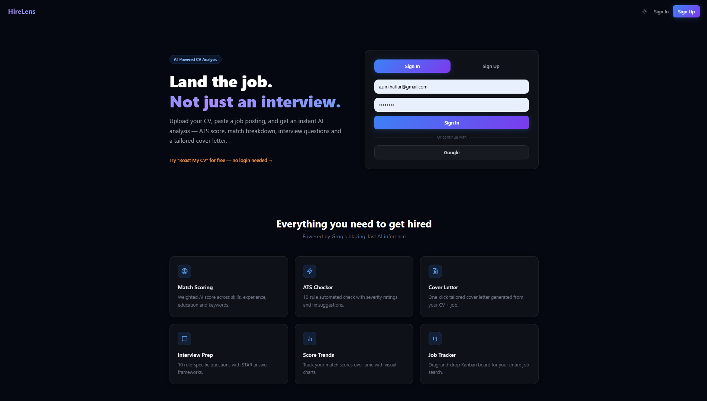
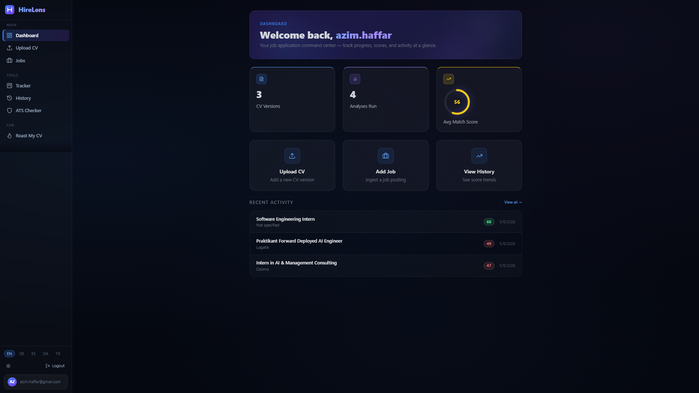
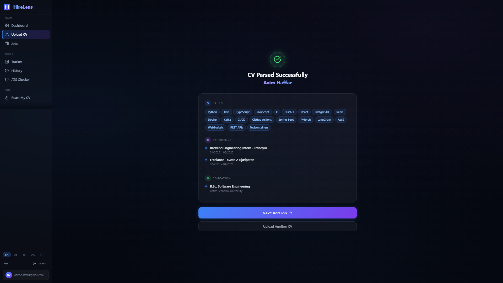
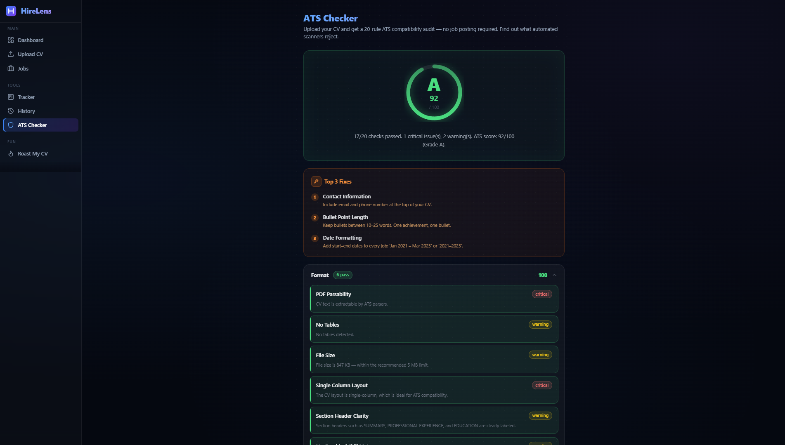
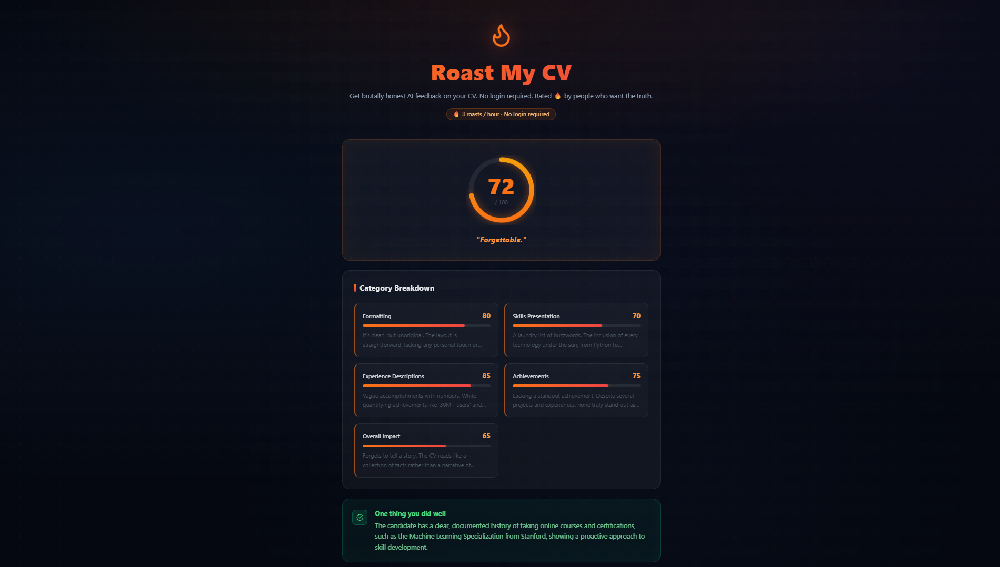

# HireLens

> AI-powered CV analysis platform — instant match scoring, ATS auditing, interview preparation, cover letter generation, and job application tracking.

[](https://react.dev)
[](https://vitejs.dev)
[](https://fastapi.tiangolo.com)
[](https://python.org)
[](https://supabase.com)
[](https://docker.com)
[](LICENSE)

**Live Demo:** [hirelens-alpha.vercel.app](https://hirelens-alpha.vercel.app)

---

## Screenshots







---

## Overview

HireLens helps job seekers understand exactly how well their CV matches a specific job posting — and what to fix. Upload a PDF CV, paste or scrape a job description, and receive a weighted AI score with a full breakdown across skills, experience, education, and keyword coverage.

The platform is built as a production-ready full-stack application with authentication, real-time SSE streaming, a drag-and-drop Kanban tracker, multilingual support (EN / DE / ES / DA / TR), and a public "Roast My CV" endpoint — no login required.

---

## Tech Stack

| Layer                  | Technology                                                                 |
|------------------------|----------------------------------------------------------------------------|
| **Frontend**           | React 18, Vite, Tailwind CSS, react-i18next, Recharts, @dnd-kit           |
| **Backend**            | Python 3.11, FastAPI, SlowAPI (rate limiting), pdfplumber, BeautifulSoup4  |
| **AI**                 | Groq API — LLaMA 3.3 70B (primary), LLaMA 3 8B (fallback), LLaMA 3.1 8B  |
| **Database**           | Supabase (PostgreSQL + Row-Level Security + Auth)                          |
| **Cache / Rate Limit** | Redis                                                                      |
| **Deployment**         | Vercel (frontend), Render (backend), Docker Compose (local)                |

---

## Features

| #  | Feature                    | Description                                                                        |
|----|----------------------------|------------------------------------------------------------------------------------|
| 1  | **Authentication**         | Email/password + Google OAuth via Supabase                                         |
| 2  | **CV Upload & Parsing**    | PDF upload → pdfplumber text extraction → Groq structured JSON                     |
| 3  | **Job Ingestion**          | URL scraping (BeautifulSoup4) or paste → Groq extraction                           |
| 4  | **Match Scoring**          | Weighted AI score: skills 35 %, experience 25 %, education 15 %, keywords 25 %    |
| 5  | **ATS Audit**              | 10-rule automated check with severity levels (critical / warning / info)           |
| 6  | **AI Score Explanation**   | SSE-streamed plain-English breakdown of the match score                            |
| 7  | **Interview Preparation**  | 10 role-specific questions with STAR answer frameworks                             |
| 8  | **Cover Letter Generator** | One-click tailored cover letter with subject line                                  |
| 9  | **CV Comparison**          | Side-by-side score diff between two CV versions against the same job               |
| 10 | **Application Tracker**    | Drag-and-drop Kanban: Saved → Applied → Interview → Offer → Rejected → Ghosted    |
| 11 | **History & Trends**       | Searchable analysis history with a Recharts score trend chart                      |
| 12 | **Roast My CV**            | Public, rate-limited (3 / hour / IP) brutal AI feedback — no login required       |
| 13 | **AI Chat**                | Floating SSE chat panel scoped to the current CV + job analysis                    |
| 14 | **Light / Dark Mode**      | Tailwind class strategy (`html.dark`), persisted in localStorage                   |
| 15 | **Internationalisation**   | EN / DE / ES / DA / TR via react-i18next                                           |

---

## Architecture

```text
┌─────────────────────────────────────────────────────────────┐
│                         HireLens                             │
│                                                              │
│  ┌──────────────┐    HTTP / SSE   ┌──────────────────────┐  │
│  │   Frontend   │◄───────────────►│   Backend (FastAPI)  │  │
│  │ React + Vite │                 │   Python 3.11        │  │
│  │ Tailwind CSS │                 │   SlowAPI            │  │
│  │ react-i18next│                 │   pdfplumber         │  │
│  │ Recharts     │                 │   BeautifulSoup4     │  │
│  │ @dnd-kit     │                 └──────────┬───────────┘  │
│  └──────────────┘                            │              │
│                                              │              │
│  ┌───────────────────────────────────────────┼────────────┐ │
│  │            External Services              │            │ │
│  │                                           │            │ │
│  │  ┌─────────────┐  ┌──────────┐  ┌────────▼─────────┐  │ │
│  │  │  Supabase   │  │  Redis   │  │    Groq API      │  │ │
│  │  │ PostgreSQL  │  │  Cache   │  │ llama-3.3-70b    │  │ │
│  │  │ Auth + RLS  │  │ Rate Lmt │  │ llama3-8b-8192   │  │ │
│  │  │  Storage    │  └──────────┘  │ llama-3.1-8b     │  │ │
│  │  └─────────────┘                └──────────────────┘  │ │
│  └────────────────────────────────────────────────────────┘ │
└─────────────────────────────────────────────────────────────┘
```

---

## Quick Start

### Prerequisites

- Node.js 18+
- Python 3.11+
- Docker & Docker Compose (recommended)
- A [Supabase](https://supabase.com) project
- A [Groq](https://console.groq.com) API key

### Option A — Docker Compose (recommended)

```bash
# 1. Clone the repository
git clone https://github.com/azim-haffar/HireLens.git
cd HireLens

# 2. Configure environment variables
cp backend/.env.example backend/.env
cp frontend/.env.example frontend/.env
# Edit both .env files with your keys

# 3. Start all services
docker-compose up --build
```

| Service              | URL                          |
|----------------------|------------------------------|
| Frontend             | <http://localhost:5173>      |
| Backend API          | <http://localhost:8001>      |
| Interactive API docs | <http://localhost:8001/docs> |

### Option B — Local Development

#### Backend

```bash
cd backend
python -m venv venv
source venv/bin/activate      # Windows: venv\Scripts\activate
pip install -r requirements.txt
uvicorn app.main:app --reload
```

#### Frontend

```bash
cd frontend
npm install
npm run dev
```

### Supabase Setup

1. Create a project at [supabase.com](https://supabase.com)
2. Run `supabase/migrations.sql` in the SQL Editor
3. Enable Google OAuth under **Authentication → Providers → Google**
4. Copy the project URL and keys into `backend/.env` and `frontend/.env`

---

## Environment Variables

### Backend — `backend/.env`

| Variable                    | Description                                             |
|-----------------------------|---------------------------------------------------------|
| `GROQ_API_KEY`              | Groq API key — [console.groq.com](https://console.groq.com) |
| `SUPABASE_URL`              | Supabase project URL                                    |
| `SUPABASE_ANON_KEY`         | Supabase anon/public key                                |
| `SUPABASE_SERVICE_ROLE_KEY` | Supabase service role key (server-side only)            |
| `RESEND_API_KEY`            | Resend API key for transactional email                  |
| `REDIS_URL`                 | Redis connection URL (default: `redis://redis:6379`)    |
| `ENVIRONMENT`               | `development` or `production`                           |

### Frontend — `frontend/.env`

| Variable                 | Description                                          |
|--------------------------|------------------------------------------------------|
| `VITE_SUPABASE_URL`      | Supabase project URL                                 |
| `VITE_SUPABASE_ANON_KEY` | Supabase anon/public key                             |
| `VITE_API_URL`           | Backend base URL (default: `http://localhost:8001`)  |

---

## Deployment

### Frontend → Vercel

```bash
vercel --cwd frontend
```

Add the three `VITE_*` environment variables in the Vercel project dashboard.

### Backend → Render

Connect the repository to Render and use the included `render.yaml` Blueprint for automatic setup, or configure manually:

- **Build command:** `pip install -r requirements.txt`
- **Start command:** `uvicorn app.main:app --host 0.0.0.0 --port $PORT`

---

## AI Model Fallback Chain

The backend selects the most capable available model and falls back automatically:

1. `llama-3.3-70b-versatile` — primary, highest quality
2. `llama3-8b-8192` — fallback
3. `llama-3.1-8b-instant` — last resort

---

## API Reference

Full interactive documentation is available at `/docs` when the backend is running.

| Method | Endpoint                 | Description                                     |
|--------|--------------------------|-------------------------------------------------|
| `POST` | `/cv/upload`             | Upload and parse a PDF CV                       |
| `POST` | `/jobs/ingest`           | Ingest a job posting from URL or raw text       |
| `POST` | `/match/score`           | Compute weighted match score                    |
| `POST` | `/ats/check`             | Run ATS compliance audit                        |
| `POST` | `/explain/stream`        | Stream AI score explanation (SSE)               |
| `POST` | `/interview/generate`    | Generate interview questions                    |
| `POST` | `/cover-letter/generate` | Generate tailored cover letter                  |
| `POST` | `/comparison/compare`    | Compare two CV versions                         |
| `GET`  | `/tracker/applications`  | List tracked job applications                   |
| `POST` | `/roast/cv`              | Public CV roast — rate-limited, no auth         |
| `POST` | `/chat/stream`           | Stream AI chat scoped to current analysis (SSE) |

---

## Project Structure

```text
HireLens/
├── backend/
│   ├── app/
│   │   ├── routers/        # One file per feature (cv, jobs, match, ats, …)
│   │   ├── services/       # CV parsing, job scraping, Groq client
│   │   ├── models/         # Pydantic response schemas
│   │   └── main.py         # FastAPI app, CORS, rate-limit middleware
│   ├── requirements.txt
│   └── Dockerfile
├── frontend/
│   ├── src/
│   │   ├── components/     # Layout, ScoreGauge, StreamingText, ChatPanel, …
│   │   ├── pages/          # One file per route
│   │   ├── hooks/          # useAuth, useTheme
│   │   ├── lib/            # API client, i18n config, theme helpers
│   │   └── locales/        # Translation files (en, de, es, da, tr)
│   ├── public/
│   └── index.html
├── supabase/
│   └── migrations.sql
└── docker-compose.yml
```

---

## License

MIT — see [LICENSE](LICENSE) for details.