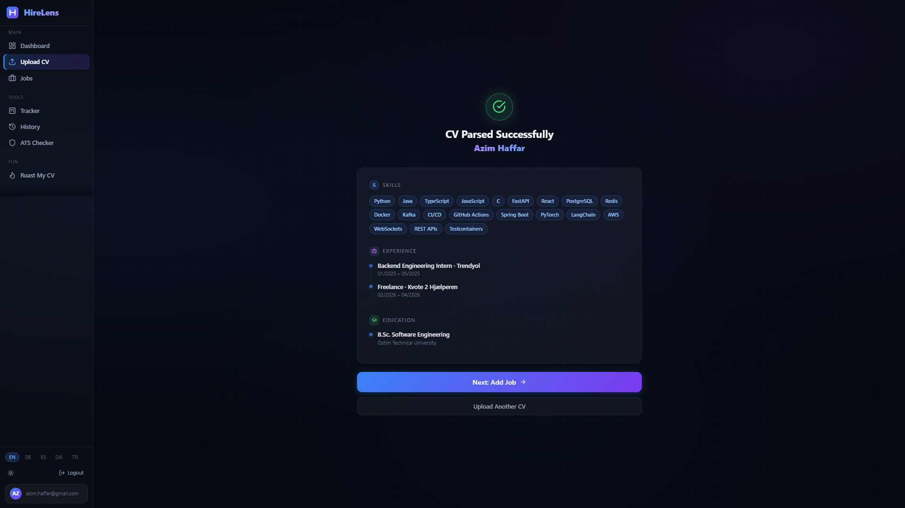

# HireLens
### A CV, a vacancy, and an explanation you can inspect.

**FastAPI · React · Supabase · Groq · Redis**

[Live frontend](https://hirelens-alpha.vercel.app) · [Scoring implementation](backend/app/services/match_scorer.py) · [Tests](backend/tests) · [MIT license](LICENSE)



## What it does

Upload a PDF CV and supply a job description. HireLens combines structured LLM extraction with a rule-based match score and AI-generated explanations. The application also includes interview preparation, cover letters, CV comparison, analysis history, and an application tracker.

| Layer | Responsibility |
| --- | --- |
| React + Vite | CV/job inputs, analysis views, application tracking |
| FastAPI | Dedicated routers, PDF parsing, scoring, LLM orchestration |
| Groq | Structured extraction and generated text |
| Supabase | Authentication and PostgreSQL persistence |
| Redis | Backend caching infrastructure |

## Scores you can trace

The match score weights **skills 35%, experience entries 25%, education 15%, and keywords 25%**. Skill matching normalizes case and whitespace; keyword matching uses word boundaries so Java does not match JavaScript. Matched and missing skill lists are sorted for repeatable output.

These are application heuristics, **not a real employer ATS score or a hiring prediction**. Experience scoring counts entries rather than calculating years; education matching is coarse. Generated advice needs human review. No user-count, accuracy, or commercial-adoption claim is made. This project uses LLM APIs; it does not implement a retrieval/vector-search pipeline.

## Run locally

Native frontend development requires Node.js 22.12 or newer.

Native frontend development requires Node.js 22.12 or newer.

Requires Docker Compose, a Supabase project, and a Groq API key.

1. Run [`supabase/migrations.sql`](supabase/migrations.sql) in your own Supabase project's SQL editor and configure authentication.
2. Copy the environment examples:

```sh
cp backend/.env.example backend/.env
cp frontend/.env.example frontend/.env
```

3. Fill in your own values. `SUPABASE_SERVICE_ROLE_KEY` and `GROQ_API_KEY` belong only in the backend. The frontend uses the public anon key; database access must be protected by row-level security. Never commit either `.env` file.
4. Start the services:

```sh
docker compose up --build
```

Frontend: `http://localhost:5173` · API: `http://localhost:8001` · API docs: `http://localhost:8001/docs`.

For a native backend, use Python 3.11, install `backend/requirements.txt`, set `REDIS_URL=redis://localhost:6379`, and run `uvicorn app.main:app --reload` from `backend`. Set frontend `VITE_API_URL=http://localhost:8000` for that mode, then run `npm ci` and `npm run dev` from `frontend`.

## Checks

```sh
# From backend; scoring tests need only Pydantic
python -m pip install 'pydantic==2.7.1'
python -m unittest discover -s tests -v

# From frontend
npm ci
npm run build
```

CI runs the scoring regression tests and frontend build without paid API calls or personal CVs. It does not validate live provider responses, Supabase permissions, or end-to-end authenticated workflows. The public frontend depends on external services and may require sign-in.
